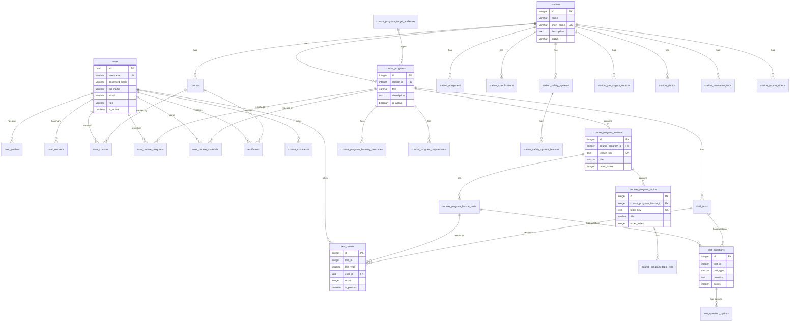

# Полный анализ структуры базы данных ATG Education

## Обзор

База данных содержит **34 таблицы**, все из которых:
- **34 таблицы** активно используются в приложении (имеют Django модели)
- **6 неиспользуемых таблиц** были удалены (см. раздел "Неиспользуемые таблицы")

## Статистика базы данных

| Категория | Количество |
|-----------|------------|
| Всего таблиц | 34 |
| Используемых таблиц | 34 |
| Удаленных неиспользуемых таблиц | 6 |
| Всего индексов | ~115 (после удаления таблиц) |
| Всего внешних ключей | ~30 |

---

## Неиспользуемые таблицы

**Статус:** ✅ **УДАЛЕНЫ**

Следующие таблицы были удалены из базы данных, так как они не использовались в приложении:

| Таблица | Заменена на | Статус |
|---------|-------------|--------|
| `lessons` | `course_program_lessons` | ✅ Удалена |
| `topics` | `course_program_topics` | ✅ Удалена |
| `topic_files` | `course_program_topic_files` | ✅ Удалена |
| `lesson_tests` | `course_program_lesson_tests` | ✅ Удалена |
| `lesson_materials` | - | ✅ Удалена |
| `user_stats` | - | ✅ Удалена |

**Дата удаления:** Выполнено автоматически через PostgreSQL MCP

**Примечание:** Все таблицы были пустыми (0 записей) и безопасно удалены с использованием `CASCADE` для автоматического удаления зависимостей.

---

## Структура используемых таблиц

### 1. Курсы и программы обучения

#### `courses`
- **Колонок:** 10
- **Индексов:** 3
- **Внешних ключей:** 1
- **Описание:** Основная таблица курсов
- **Связи:** `station_id` → `stations.id`

#### `course_programs`
- **Колонок:** 13
- **Индексов:** 4
- **Внешних ключей:** 1
- **Описание:** Программы курсов, привязанные к станциям
- **Связи:** `station_id` → `stations.id`
- **Особенности:** Уникальный индекс на `(station_id)` где `is_active = true` (только одна активная программа на станцию)

#### `course_program_lessons`
- **Колонок:** 9
- **Индексов:** 4
- **Внешних ключей:** 1
- **Описание:** Уроки программы курса
- **Связи:** `course_program_id` → `course_programs.id`
- **Особенности:** Уникальный индекс на `lesson_key`

#### `course_program_topics`
- **Колонок:** 10
- **Индексов:** 4
- **Внешних ключей:** 1
- **Описание:** Темы уроков
- **Связи:** `course_program_lesson_id` → `course_program_lessons.id`
- **Особенности:** Уникальный индекс на `topic_key`

#### `course_program_topic_files`
- **Колонок:** 13
- **Индексов:** 4
- **Внешних ключей:** 1
- **Описание:** Файлы (PDF, видео, документы) для тем
- **Связи:** `course_program_topic_id` → `course_program_topics.id`
- **Особенности:** Индексы на `object_key`, `(course_program_topic_id, is_main)`, `(course_program_topic_id, order_index)`

#### `course_program_learning_outcomes`
- **Колонок:** 5
- **Индексов:** 2
- **Внешних ключей:** 1
- **Описание:** Результаты обучения программы
- **Связи:** `course_program_id` → `course_programs.id`

#### `course_program_requirements`
- **Колонок:** 5
- **Индексов:** 2
- **Внешних ключей:** 1
- **Описание:** Требования к программе
- **Связи:** `course_program_id` → `course_programs.id`

#### `course_program_target_audience`
- **Колонок:** 5
- **Индексов:** 2
- **Внешних ключей:** 1
- **Описание:** Целевая аудитория программы
- **Связи:** `course_program_id` → `course_programs.id`

### 2. Тестирование

#### `course_program_lesson_tests`
- **Колонок:** 11
- **Индексов:** 3
- **Внешних ключей:** 1
- **Описание:** Тесты для уроков
- **Связи:** `course_program_lesson_id` → `course_program_lessons.id`
- **Особенности:** Индекс на `(course_program_lesson_id, is_active)` для быстрого поиска активных тестов

#### `final_tests`
- **Колонок:** 11
- **Индексов:** 2
- **Внешних ключей:** 1
- **Описание:** Финальные тесты программы
- **Связи:** `course_program_id` → `course_programs.id`

#### `test_questions`
- **Колонок:** 10
- **Индексов:** 2
- **Внешних ключей:** 0 (связь через `test_id` + `test_type`)
- **Описание:** Вопросы для тестов (общие для lesson и final)
- **Особенности:** Составной индекс на `(test_id, test_type)` для связи с тестами

#### `test_question_options`
- **Колонок:** 6
- **Индексов:** 2
- **Внешних ключей:** 1
- **Описание:** Варианты ответов на вопросы
- **Связи:** `question_id` → `test_questions.id`

#### `test_results`
- **Колонок:** 12
- **Индексов:** 3
- **Внешних ключей:** 1
- **Описание:** Результаты прохождения тестов
- **Связи:** `user_id` → `users.id`
- **Особенности:** Составной индекс на `(test_id, test_type)` для связи с тестами

### 3. Пользователи и прогресс

#### `users`
- **Колонок:** 9
- **Индексов:** 7
- **Внешних ключей:** 0
- **Описание:** Основная таблица пользователей
- **Особенности:** 
  - Уникальный индекс на `username`
  - Уникальный индекс на `lower(email)` (case-insensitive)
  - Индексы на `email`, `is_active`, `role`

#### `user_profiles`
- **Колонок:** 14
- **Индексов:** 2
- **Внешних ключей:** 1
- **Описание:** Расширенный профиль пользователя
- **Связи:** `id` → `users.id` (OneToOne)
- **Особенности:** Индекс на `email`

#### `user_sessions`
- **Колонок:** 8
- **Индексов:** 5
- **Внешних ключей:** 1
- **Описание:** Сессии пользователей
- **Связи:** `user_id` → `users.id`
- **Особенности:** 
  - Уникальный индекс на `session_token`
  - Индексы на `user_id`, `expires_at`, `session_token`

#### `ldap_temp_sessions`
- **Колонок:** 11
- **Индексов:** 4
- **Внешних ключей:** 0
- **Описание:** Временные сессии для LDAP-аутентификации при первой регистрации
- **Особенности:** 
  - Уникальный индекс на `session_token`
  - Индексы на `lower(ldap_email)`, `expires_at`

#### `user_courses`
- **Колонок:** 11
- **Индексов:** 6
- **Внешних ключей:** 2
- **Описание:** Записи пользователей на курсы
- **Связи:** 
  - `user_id` → `users.id`
  - `course_id` → `courses.id`
- **Особенности:** 
  - Уникальный индекс на `(user_id, course_id)`
  - Индексы на `user_id`, `course_id`, `status`, `last_activity DESC`

#### `user_course_programs`
- **Колонок:** 11
- **Индексов:** 6
- **Внешних ключей:** 2
- **Описание:** Записи пользователей на программы курсов
- **Связи:** 
  - `user_id` → `users.id`
  - `course_program_id` → `course_programs.id`
- **Особенности:** 
  - Уникальный индекс на `(user_id, course_program_id)`
  - Индексы на `user_id`, `course_program_id`, `status`, `last_activity DESC`

#### `user_course_materials`
- **Колонок:** 8
- **Индексов:** 4
- **Внешних ключей:** 2
- **Описание:** Отслеживание просмотра материалов пользователями
- **Связи:** 
  - `user_id` → `users.id`
  - `course_program_id` → `course_programs.id`
- **Особенности:** 
  - Уникальный индекс на `(user_id, course_program_id, material_type, material_key)`
  - Индексы на `(user_id, course_program_id)`, `is_completed`

#### `certificates`
- **Колонок:** 7
- **Индексов:** 4
- **Внешних ключей:** 2
- **Описание:** Сертификаты пользователей
- **Связи:** 
  - `user_id` → `users.id`
  - `course_id` → `courses.id`
- **Особенности:** Индексы на `user_id`, `course_id`, `issued_at DESC`

#### `course_comments`
- **Колонок:** 9
- **Индексов:** 5
- **Внешних ключей:** 1
- **Описание:** Комментарии пользователей к материалам курса
- **Связи:** `user_id` → `users.id`
- **Особенности:** 
  - Индекс на `(station_id, lesson_index, topic_index)` для быстрого поиска комментариев к конкретному материалу
  - Индекс на `file_object_key` (частичный, WHERE file_object_key IS NOT NULL)
  - Индекс на `created_at DESC`

### 4. Станции

#### `stations`
- **Колонок:** 21
- **Индексов:** 4
- **Внешних ключей:** 0
- **Описание:** Газокомпрессорные станции
- **Особенности:** 
  - Уникальный индекс на `short_name`
  - Индексы на `short_name`, `status`

#### `station_equipment`
- **Колонок:** 10
- **Индексов:** 2
- **Внешних ключей:** 1
- **Описание:** Оборудование станций
- **Связи:** `station_id` → `stations.id`

#### `station_specifications`
- **Колонок:** 8
- **Индексов:** 2
- **Внешних ключей:** 1
- **Описание:** Технические характеристики станций
- **Связи:** `station_id` → `stations.id`

#### `station_safety_systems`
- **Колонок:** 7
- **Индексов:** 2
- **Внешних ключей:** 1
- **Описание:** Системы безопасности станций
- **Связи:** `station_id` → `stations.id`

#### `station_safety_system_features`
- **Колонок:** 5
- **Индексов:** 2
- **Внешних ключей:** 1
- **Описание:** Особенности систем безопасности
- **Связи:** `safety_system_id` → `station_safety_systems.id`

#### `station_gas_supply_sources`
- **Колонок:** 5
- **Индексов:** 2
- **Внешних ключей:** 1
- **Описание:** Источники газоснабжения
- **Связи:** `station_id` → `stations.id`

#### `station_photos`
- **Колонок:** 7
- **Индексов:** 3
- **Внешних ключей:** 1
- **Описание:** Фотографии станций
- **Связи:** `station_id` → `stations.id`
- **Особенности:** Составной индекс на `(station_id, order_index)`

#### `station_normative_docs`
- **Колонок:** 5
- **Индексов:** 2
- **Внешних ключей:** 1
- **Описание:** Нормативные документы станций
- **Связи:** `station_id` → `stations.id`

#### `station_promo_videos`
- **Колонок:** 7
- **Индексов:** 3
- **Внешних ключей:** 1
- **Описание:** Промо-видео станций
- **Связи:** `station_id` → `stations.id`
- **Особенности:** Составной индекс на `(station_id, is_active)`

#### `departments`
- **Колонок:** 12
- **Индексов:** 2
- **Внешних ключей:** 0
- **Описание:** Отделы/департаменты
- **Особенности:** 
  - Уникальный индекс на `short_name`
  - Поддержка мультиязычности (`name_ru`, `name_en`, `description_ru`, `description_en`)

### 5. Системные таблицы

#### `site_settings`
- **Колонок:** 4
- **Индексов:** 1
- **Внешних ключей:** 0
- **Описание:** Настройки сайта (singleton таблица, id=1)
- **Особенности:** Хранит только MinIO object keys, не публичные URL

#### `hero_slider_images`
- **Колонок:** 6
- **Индексов:** 2
- **Внешних ключей:** 0
- **Описание:** Изображения для главного слайдера
- **Особенности:** 
  - Составной индекс на `(order_index, is_active)`
  - Хранит MinIO object keys

#### `video_transcode_jobs`
- **Колонок:** 7 (из модели)
- **Индексов:** Не указано в результатах
- **Внешних ключей:** 0
- **Описание:** Задачи транскодирования видео
- **Особенности:** Таблица для управления фоновыми задачами обработки видео

---

## ER-диаграмма связей



---

## Анализ индексов

### Общая статистика
- **Всего индексов:** 123
- **Уникальных индексов:** ~40 (включая PRIMARY KEY)
- **Составных индексов:** ~25

### Ключевые индексы по категориям

#### Индексы для производительности запросов пользователей
- `idx_user_course_programs_user` - быстрый поиск программ пользователя
- `idx_user_course_programs_last_activity` - сортировка по активности
- `idx_test_results_user` - результаты тестов пользователя
- `idx_user_sessions_user_id` - сессии пользователя

#### Индексы для производительности курсов
- `idx_course_program_lessons_program` - уроки программы
- `idx_course_program_topics_lesson` - темы урока
- `idx_cptf_topic_order` - файлы темы в порядке
- `idx_lesson_tests_active` - активные тесты урока

#### Индексы для поиска
- `idx_users_email_unique_ci` - поиск по email (case-insensitive)
- `idx_users_username` - поиск по username
- `idx_course_comments_station_lesson_topic` - комментарии к материалу

### Рекомендации по индексам

1. **Хорошо оптимизированы:**
   - Таблицы с частыми JOIN операциями имеют индексы на внешних ключах
   - Составные индексы для частых запросов с несколькими условиями
   - Частичные индексы где это уместно (например, `idx_course_comments_file`)

2. **Потенциальные улучшения:**
   - Рассмотреть индекс на `(user_id, status)` в `user_course_programs` для фильтрации по статусу
   - Рассмотреть индекс на `(course_program_id, is_active)` в `course_program_topic_files` если часто фильтруем по активности

---

## Анализ связей (Foreign Keys)

### Иерархия зависимостей

```
stations (корневая)
  ├── courses
  ├── course_programs
  │   ├── course_program_lessons
  │   │   ├── course_program_topics
  │   │   │   └── course_program_topic_files
  │   │   └── course_program_lesson_tests
  │   ├── final_tests
  │   ├── course_program_learning_outcomes
  │   ├── course_program_requirements
  │   └── course_program_target_audience
  ├── station_equipment
  ├── station_specifications
  ├── station_safety_systems
  │   └── station_safety_system_features
  ├── station_gas_supply_sources
  ├── station_photos
  ├── station_normative_docs
  └── station_promo_videos

users (корневая)
  ├── user_profiles (OneToOne)
  ├── user_sessions
  ├── user_courses
  ├── user_course_programs
  ├── user_course_materials
  ├── test_results
  ├── certificates
  └── course_comments
```

### Особенности связей

1. **Каскадное удаление:** Все внешние ключи используют `ON DELETE CASCADE`, что обеспечивает целостность данных при удалении родительских записей.

2. **Связи без FK:**
   - `test_questions.test_id` + `test_type` - связь с `course_program_lesson_tests` или `final_tests` определяется на уровне приложения
   - `test_results.test_id` + `test_type` - аналогично

3. **Уникальные ограничения:**
   - `(user_id, course_program_id)` в `user_course_programs` - один пользователь может быть записан на программу только один раз
   - `(user_id, course_id)` в `user_courses` - аналогично
   - `(user_id, course_program_id, material_type, material_key)` в `user_course_materials` - уникальность просмотра материала

---

## Рекомендации по оптимизации

### 1. Удаление неиспользуемых таблиц
✅ **ВЫПОЛНЕНО:** Все 6 неиспользуемых таблиц были успешно удалены для упрощения структуры БД.

### 2. Оптимизация индексов
- Текущая структура индексов хорошо оптимизирована
- Рекомендуется периодически анализировать использование индексов через `pg_stat_user_indexes`

### 3. Мониторинг производительности
- Настроить мониторинг медленных запросов
- Отслеживать размер таблиц и индексов
- Регулярно выполнять `VACUUM ANALYZE`

### 4. Резервное копирование
- Рекомендуется регулярное резервное копирование перед удалением таблиц
- Использовать `pg_dump` для создания дампов структуры и данных

### 5. Документирование изменений
- Все изменения структуры БД должны документироваться
- Использовать миграции Django для версионирования схемы

---

## Заключение

База данных имеет хорошо структурированную схему с четкой иерархией связей. Индексы оптимизированы для основных запросов. Основные рекомендации:

1. ✅ Удалить 6 неиспользуемых пустых таблиц
2. ✅ Продолжать мониторинг производительности
3. ✅ Регулярно обновлять статистику через `ANALYZE`
4. ✅ Документировать все изменения структуры

---

*Документ создан: {{ current_date }}*
*Версия БД: PostgreSQL (версия уточняется)*
