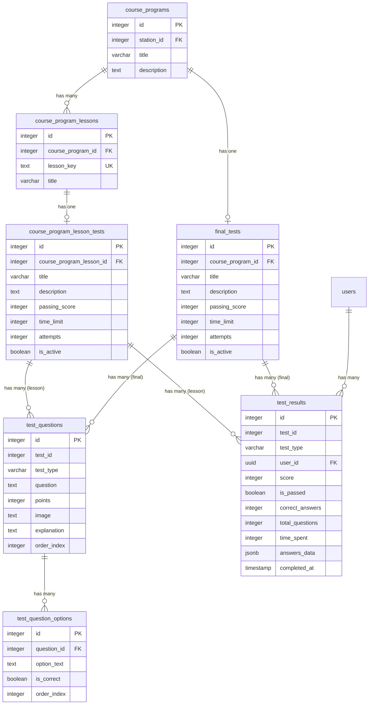

# Структура базы данных тестовой системы

## Обзор

Тестовая система поддерживает два типа тестов:
- **Тесты уроков** (`lesson`) - тесты, привязанные к конкретным урокам программы курса
- **Финальные тесты** (`final`) - тесты, привязанные к программе курса в целом

## Диаграмма связей



## Таблицы

### 1. course_program_lesson_tests

Тесты для уроков программы курса.

**Структура:**

| Поле | Тип | Nullable | Default | Описание |
|------|-----|----------|---------|-----------|
| `id` | INTEGER | NOT NULL | `nextval(...)` | Первичный ключ |
| `course_program_lesson_id` | INTEGER | NOT NULL | - | FK → `course_program_lessons.id` |
| `title` | VARCHAR | NOT NULL | - | Название теста |
| `description` | TEXT | NULL | - | Описание теста |
| `questions_count` | INTEGER | NULL | `0` | Количество вопросов (вычисляемое) |
| `passing_score` | INTEGER | NULL | `70` | Проходной балл (0-100%) |
| `time_limit` | INTEGER | NULL | `30` | Лимит времени в минутах |
| `attempts` | INTEGER | NULL | - | Количество попыток (NULL = неограниченно) |
| `is_active` | BOOLEAN | NULL | `true` | Активен ли тест |
| `created_at` | TIMESTAMP | NULL | `CURRENT_TIMESTAMP` | Дата создания |
| `updated_at` | TIMESTAMP | NULL | `CURRENT_TIMESTAMP` | Дата обновления |

**Ограничения:**
- PRIMARY KEY: `id`
- FOREIGN KEY: `course_program_lesson_id` → `course_program_lessons(id)` ON DELETE CASCADE

**Индексы:**
- `course_program_lesson_tests_pkey` (UNIQUE) на `id`
- `idx_lesson_tests_lesson` на `course_program_lesson_id`
- `idx_lesson_tests_active` на `(course_program_lesson_id, is_active)`

**Связи:**
- Один урок может иметь несколько тестов (но обычно используется только последний активный)
- Один тест урока может иметь множество вопросов (`test_questions` с `test_type='lesson'`)
- Один тест урока может иметь множество результатов (`test_results` с `test_type='lesson'`)

---

### 2. final_tests

Финальные тесты для программы курса.

**Структура:**

| Поле | Тип | Nullable | Default | Описание |
|------|-----|----------|---------|-----------|
| `id` | INTEGER | NOT NULL | `nextval(...)` | Первичный ключ |
| `course_program_id` | INTEGER | NOT NULL | - | FK → `course_programs.id` |
| `title` | VARCHAR | NOT NULL | - | Название теста |
| `description` | TEXT | NULL | - | Описание теста |
| `questions_count` | INTEGER | NULL | `0` | Количество вопросов (вычисляемое) |
| `passing_score` | INTEGER | NULL | `70` | Проходной балл (0-100%) |
| `time_limit` | INTEGER | NULL | `30` | Лимит времени в минутах |
| `attempts` | INTEGER | NULL | - | Количество попыток (NULL = неограниченно) |
| `is_active` | BOOLEAN | NULL | `true` | Активен ли тест |
| `created_at` | TIMESTAMP | NULL | `CURRENT_TIMESTAMP` | Дата создания |
| `updated_at` | TIMESTAMP | NULL | `CURRENT_TIMESTAMP` | Дата обновления |

**Ограничения:**
- PRIMARY KEY: `id`
- FOREIGN KEY: `course_program_id` → `course_programs(id)` ON DELETE CASCADE

**Индексы:**
- `final_tests_pkey` (UNIQUE) на `id`
- `idx_final_tests_course` на `course_program_id`

**Связи:**
- Одна программа курса может иметь один финальный тест
- Один финальный тест может иметь множество вопросов (`test_questions` с `test_type='final'`)
- Один финальный тест может иметь множество результатов (`test_results` с `test_type='final'`)

---

### 3. test_questions

Вопросы для тестов (общие для уроков и финальных тестов).

**Структура:**

| Поле | Тип | Nullable | Default | Описание |
|------|-----|----------|---------|-----------|
| `id` | INTEGER | NOT NULL | `nextval(...)` | Первичный ключ |
| `test_id` | INTEGER | NOT NULL | - | ID теста (lesson или final) |
| `test_type` | VARCHAR | NOT NULL | - | Тип теста: `'lesson'` или `'final'` |
| `question` | TEXT | NOT NULL | - | Текст вопроса |
| `points` | INTEGER | NULL | `1` | Баллы за правильный ответ |
| `image` | TEXT | NULL | - | URL изображения к вопросу |
| `explanation` | TEXT | NULL | - | Пояснение к правильному ответу |
| `order_index` | INTEGER | NULL | `0` | Порядок отображения вопроса |
| `created_at` | TIMESTAMP | NULL | `CURRENT_TIMESTAMP` | Дата создания |
| `updated_at` | TIMESTAMP | NULL | `CURRENT_TIMESTAMP` | Дата обновления |

**Ограничения:**
- PRIMARY KEY: `id`
- CHECK: `test_type IN ('lesson', 'final')`

**Индексы:**
- `test_questions_pkey` (UNIQUE) на `id`
- `idx_test_questions_test` на `(test_id, test_type)`

**Связи:**
- Один вопрос принадлежит одному тесту (определяется `test_id` + `test_type`)
- Один вопрос может иметь множество вариантов ответа (`test_question_options`)

**Примечание:**
- `test_id` ссылается на `course_program_lesson_tests.id` если `test_type='lesson'`
- `test_id` ссылается на `final_tests.id` если `test_type='final'`
- Внешний ключ не определен на уровне БД, связь поддерживается на уровне приложения

---

### 4. test_question_options

Варианты ответов для вопросов.

**Структура:**

| Поле | Тип | Nullable | Default | Описание |
|------|-----|----------|---------|-----------|
| `id` | INTEGER | NOT NULL | `nextval(...)` | Первичный ключ |
| `question_id` | INTEGER | NOT NULL | - | FK → `test_questions.id` |
| `option_text` | TEXT | NOT NULL | - | Текст варианта ответа |
| `is_correct` | BOOLEAN | NULL | `false` | Правильный ли это ответ |
| `order_index` | INTEGER | NULL | `0` | Порядок отображения варианта |
| `created_at` | TIMESTAMP | NULL | `CURRENT_TIMESTAMP` | Дата создания |

**Ограничения:**
- PRIMARY KEY: `id`
- FOREIGN KEY: `question_id` → `test_questions(id)` ON DELETE CASCADE

**Индексы:**
- `test_question_options_pkey` (UNIQUE) на `id`
- `idx_test_question_options_question` на `question_id`

**Связи:**
- Один вариант ответа принадлежит одному вопросу
- Один вопрос должен иметь хотя бы один правильный вариант (`is_correct=true`)

---

### 5. test_results

Результаты прохождения тестов пользователями.

**Структура:**

| Поле | Тип | Nullable | Default | Описание |
|------|-----|----------|---------|-----------|
| `id` | INTEGER | NOT NULL | `nextval(...)` | Первичный ключ |
| `test_id` | INTEGER | NOT NULL | - | ID теста (lesson или final) |
| `test_type` | VARCHAR | NOT NULL | - | Тип теста: `'lesson'` или `'final'` |
| `user_id` | UUID | NOT NULL | - | FK → `users.id` |
| `score` | INTEGER | NOT NULL | - | Процент правильных ответов (0-100) |
| `is_passed` | BOOLEAN | NULL | `false` | Прошел ли пользователь тест |
| `correct_answers` | INTEGER | NULL | `0` | Количество правильных ответов |
| `total_questions` | INTEGER | NULL | `0` | Общее количество вопросов |
| `time_spent` | INTEGER | NULL | - | Время прохождения в секундах |
| `answers_data` | JSONB | NULL | - | Детальные данные ответов пользователя |
| `completed_at` | TIMESTAMP | NULL | `CURRENT_TIMESTAMP` | Дата завершения теста |
| `created_at` | TIMESTAMP | NULL | `CURRENT_TIMESTAMP` | Дата создания записи |

**Ограничения:**
- PRIMARY KEY: `id`
- FOREIGN KEY: `user_id` → `users(id)` ON DELETE CASCADE
- CHECK: `test_type IN ('lesson', 'final')`
- CHECK: `score >= 0 AND score <= 100`

**Индексы:**
- `test_results_pkey` (UNIQUE) на `id`
- `idx_test_results_test` на `(test_id, test_type)`
- `idx_test_results_user` на `user_id`

**Связи:**
- Один результат принадлежит одному пользователю
- Один результат принадлежит одному тесту (определяется `test_id` + `test_type`)

**Формат `answers_data` (JSONB):**
```json
{
  "0": {
    "questionId": 123,
    "selectedAnswer": 1,
    "correctAnswer": 1,
    "isCorrect": true
  },
  "1": {
    "questionId": 124,
    "selectedAnswer": 0,
    "correctAnswer": 2,
    "isCorrect": false
  }
}
```

**Примечание:**
- `test_id` ссылается на `course_program_lesson_tests.id` если `test_type='lesson'`
- `test_id` ссылается на `final_tests.id` если `test_type='final'`
- Внешний ключ не определен на уровне БД, связь поддерживается на уровне приложения

---

## Связанные таблицы

### course_programs

Программы курсов (родительская таблица).

**Ключевые поля:**
- `id` - первичный ключ
- `station_id` - связь со станцией
- `title` - название программы

**Связи:**
- Одна программа курса может иметь множество уроков (`course_program_lessons`)
- Одна программа курса может иметь один финальный тест (`final_tests`)

### course_program_lessons

Уроки программы курса.

**Ключевые поля:**
- `id` - первичный ключ
- `course_program_id` - FK → `course_programs.id`
- `lesson_key` - уникальный ключ урока
- `title` - название урока

**Связи:**
- Один урок может иметь один тест (`course_program_lesson_tests`)

### users

Пользователи системы.

**Ключевые поля:**
- `id` (UUID) - первичный ключ

**Связи:**
- Один пользователь может иметь множество результатов тестов (`test_results`)

---

## Бизнес-логика

### Типы тестов

1. **Тесты уроков** (`test_type='lesson'`):
   - Привязаны к конкретному уроку через `course_program_lesson_id`
   - Один урок может иметь несколько тестов, но используется только последний активный
   - Используются для проверки знаний по конкретному уроку

2. **Финальные тесты** (`test_type='final'`):
   - Привязаны к программе курса через `course_program_id`
   - Одна программа курса обычно имеет один финальный тест
   - Используются для итоговой проверки знаний по всему курсу

### Логика работы с вопросами

- Вопросы хранятся в общей таблице `test_questions`
- Тип теста определяется полем `test_type` ('lesson' или 'final')
- Связь с конкретным тестом определяется через `test_id` + `test_type`
- Вопросы упорядочиваются по `order_index`

### Логика работы с вариантами ответов

- Каждый вопрос должен иметь минимум 2 варианта ответа
- Только один вариант должен быть правильным (`is_correct=true`)
- Варианты упорядочиваются по `order_index`

### Логика работы с результатами

- Результат сохраняется после завершения теста
- `score` вычисляется как процент правильных ответов: `(correct_answers / total_questions) * 100`
- `is_passed` определяется сравнением `score` с `passing_score` теста
- `answers_data` содержит детальную информацию о каждом ответе пользователя
- Проверка лимита попыток выполняется на уровне приложения перед сохранением результата

### Ограничения попыток

- Если `attempts = NULL`, попытки неограниченны
- Если `attempts = N`, пользователь может пройти тест максимум N раз
- Проверка выполняется на уровне приложения при сохранении результата

---

## Примеры запросов

### Получить тест урока с вопросами

```sql
SELECT 
    t.id,
    t.title,
    t.description,
    t.passing_score,
    t.time_limit,
    t.attempts,
    q.id as question_id,
    q.question,
    q.points,
    q.image,
    q.explanation,
    q.order_index as question_order,
    o.id as option_id,
    o.option_text,
    o.is_correct,
    o.order_index as option_order
FROM course_program_lesson_tests t
LEFT JOIN test_questions q ON q.test_id = t.id AND q.test_type = 'lesson'
LEFT JOIN test_question_options o ON o.question_id = q.id
WHERE t.course_program_lesson_id = :lesson_id 
  AND t.is_active = true
ORDER BY q.order_index, q.id, o.order_index, o.id;
```

### Получить результаты пользователя по тесту

```sql
SELECT 
    r.id,
    r.score,
    r.is_passed,
    r.correct_answers,
    r.total_questions,
    r.time_spent,
    r.completed_at,
    r.answers_data
FROM test_results r
WHERE r.test_id = :test_id 
  AND r.test_type = :test_type
  AND r.user_id = :user_id
ORDER BY r.completed_at DESC;
```

### Проверить количество попыток пользователя

```sql
SELECT COUNT(*) as attempts_count
FROM test_results
WHERE test_id = :test_id 
  AND test_type = :test_type
  AND user_id = :user_id;
```

---

## Миграции и изменения

При добавлении новых полей или изменении структуры:

1. Обновить Django модели в `backend_django/apps/courses/models.py`
2. Создать миграцию Django или SQL скрипт
3. Обновить сериализацию в `backend_django/apps/stations/views.py`
4. Обновить нормализацию в `src/views/admin/station-editor/useCourseProgram.js`
5. Обновить API endpoints в `backend_django/apps/courses/views.py`

---

## Примечания

- Все внешние ключи используют `ON DELETE CASCADE` для автоматического удаления связанных записей
- Временные метки (`created_at`, `updated_at`) автоматически обновляются
- Индексы оптимизированы для частых запросов по `test_id` + `test_type` и `user_id`
- JSONB поле `answers_data` позволяет хранить гибкую структуру данных ответов

